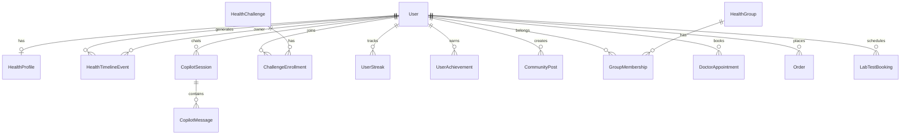
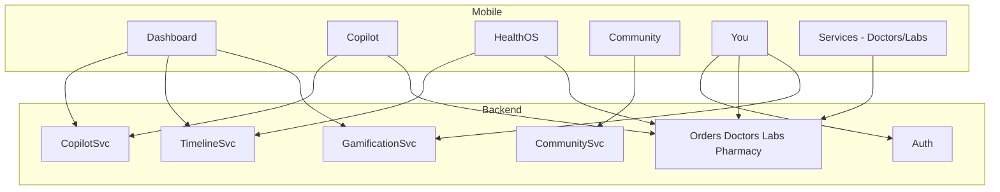
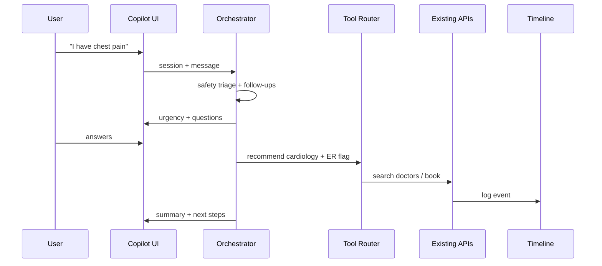

# medCare — AI Health Operating System Refactor

> **Scope:** Mobile app (`app/medCare`) — not the customer website.  
> **Goal:** Transform Pakistan's healthcare marketplace into a daily-use Health OS centered on the patient.

---

## 1. UX Redesign Summary

| Before (Marketplace) | After (Health OS) |
|---------------------|-------------------|
| Home = promo carousel + featured vendors | Home = personalized health dashboard |
| Consult / Orders / Health / Account tabs | Home / Copilot / Health / Community / You |
| User picks services manually | AI + context recommend services |
| Records siloed per feature | Unified Health Timeline |
| No daily engagement loop | Missions, streaks, XP, community |
| Vendor-centric discovery | Patient-centric journey |

**North-star question:** *Will this make users return tomorrow, even if they are perfectly healthy?*

---

## 2. UI Screen Hierarchy

```
Drawer
└── MainTabs
    ├── Home (HomeStack)
    │   ├── Dashboard              ← intelligent home
    │   ├── ServicesHub            ← contextual healthcare services
    │   └── Services (DoctorsStack)← doctors, labs, hospitals (preserved)
    ├── Copilot (CopilotStack)
    │   ├── CopilotHome            ← AI workflow entry
    │   └── CopilotSession         ← conversation + actions (Phase 2)
    ├── Health (HealthStack)       ← Personal Health OS (preserved + expanded)
    │   ├── HealthHome
    │   ├── HealthTimeline         ← Phase 2
    │   ├── MedicalRecords, FamilyProfiles, HealthHistory
    │   ├── MedicinesList → Cart → Checkout
    │   └── LabReports
    ├── Community (CommunityStack)
    │   ├── CommunityHome          ← feed, challenges, missions
    │   ├── ChallengeDetail        ← Phase 2
    │   ├── GroupDetail            ← Phase 2
    │   └── CreatePost             ← Phase 2
    └── You (YouStack)
        ├── YouHome                ← profile + gamification
        ├── OrdersList, OrderDetail, AppointmentChat
        ├── Profile, Addresses, Payments, Settings…
        └── Auth screens
```

Drawer (secondary): Emergency, Services shortcuts, Prescriptions, Help, Contact.

---

## 3. Navigation Architecture

**Primary:** 5 bottom tabs aligned to product pillars.

| Tab | Pillar | Root screen |
|-----|--------|-------------|
| Home | Dashboard + Services entry | `Dashboard` |
| Copilot | AI Health Copilot | `CopilotHome` |
| Health | Personal Health OS | `HealthHome` |
| Community | Health Community | `CommunityHome` |
| You | Profile + Orders + Settings | `YouHome` |

**Tab bar behavior:** Hidden on nested stack screens (booking, checkout, chat). Copilot tab uses elevated center FAB styling.

**Deep linking (Phase 2):** `medcare://copilot?intent=fever`, `medcare://health/timeline`, `medcare://community/challenge/:id`.

---

## 4. Information Architecture

```
Patient
├── AI Copilot (intent → workflow)
├── Health Profile (lifelong record)
│   ├── Timeline
│   ├── Conditions / Allergies / Vaccinations
│   ├── Vitals & Wearables (future)
│   ├── Prescriptions & Medicines
│   ├── Visits & Reports
│   └── Health Score & Insights
├── Services (contextual)
│   ├── Doctors
│   ├── Pharmacy
│   ├── Labs
│   └── Emergency
├── Community
│   ├── Feed
│   ├── Challenges & Missions
│   ├── Groups & Buddies
│   └── Achievements
└── Account & Rewards
    ├── XP / Streaks / Badges
    └── Orders & Payments
```

---

## 5. User Journeys

### 5.1 Symptom → Care (AI-first)

1. User opens app → Dashboard shows Health Score + AI summary  
2. Taps Copilot or types "I have fever"  
3. AI asks follow-ups, assesses urgency  
4. Recommends: rest + OTC / book GP / emergency  
5. One tap → Doctor booking (existing `DoctorsStack`)  
6. Event auto-logged to Health Timeline  
7. Post-visit: prescription → pharmacy → reminders → streak XP  

### 5.2 Daily healthy user

1. Morning dashboard: missions + medicine streak  
2. Complete water / steps mission → earn XP  
3. Read verified doctor post in Community feed  
4. Weekly AI report card → share to WhatsApp  

### 5.3 Chronic condition (Diabetes)

1. Join "Diabetes Pakistan" group  
2. Enroll in Blood Sugar Monitoring challenge  
3. Log readings → Health Timeline + AI insights  
4. Lab due reminder on Home dashboard  
5. Book HbA1c via Services hub  

---

## 6. Database Refactor (Backend — phased)

### 6.1 Keep (existing Prisma models)

`User`, `FamilyProfile`, `Order`, `Prescription`, `DoctorAppointment`, `LabTestBooking`, `Review`, etc.

### 6.2 Add (Phase 2–4)

| Model | Purpose |
|-------|---------|
| `HealthProfile` | Conditions, allergies, vaccinations, vitals JSON |
| `HealthTimelineEvent` | Unified event stream (visit, lab, med, mission) |
| `HealthScoreSnapshot` | Daily/weekly score history |
| `CopilotSession` / `CopilotMessage` | AI conversations + tool actions |
| `CommunityPost` / `CommunityComment` | Feed content |
| `HealthChallenge` / `ChallengeEnrollment` | Gamified programs |
| `DailyMission` / `MissionCompletion` | Personalized missions |
| `UserStreak` / `UserAchievement` / `UserXP` | Gamification |
| `HealthGroup` / `GroupMembership` | Support groups |
| `HealthBuddy` | Accountability partners |
| `ModerationLog` | AI moderation audit |

### 6.3 Extend (non-breaking)

- `User.profile_data` JSON → migrate structured fields to `HealthProfile` over time  
- `Notification` types → add mission, streak, AI summary channels  

---

## 7. Entity Relationship Diagram



---

## 8. API Architecture

### 8.1 Preserve (no breaking changes)

Existing `/api` routes for auth, orders, doctors, labs, pharmacy, telehealth.

### 8.2 New namespaces (versioned)

```
/api/v2/copilot/sessions
/api/v2/copilot/sessions/:id/messages
/api/v2/health/profile
/api/v2/health/timeline
/api/v2/health/score
/api/v2/community/feed
/api/v2/community/posts
/api/v2/community/challenges
/api/v2/gamification/missions
/api/v2/gamification/streaks
/api/v2/gamification/achievements
/api/v2/ai/moderate
/api/v2/ai/weekly-report
```

**Pattern:** BFF aggregators for mobile dashboard:

- `GET /api/v2/mobile/dashboard` → score, summary, missions, upcoming, streaks  
- `GET /api/v2/mobile/home-feed` → community highlights + AI tips  

---

## 9. Backend Service Architecture

```
Backend/
├── routes/           (existing — keep)
├── services/
│   ├── copilot/      CopilotOrchestrator, ToolRouter, MemoryStore
│   ├── health-os/    TimelineService, HealthScoreEngine, ProfileService
│   ├── community/    FeedService, ChallengeService, ModerationService
│   ├── gamification/ MissionGenerator, StreakService, RewardService
│   └── integrations/ (existing doctors, pharmacy, labs)
└── workers/
    ├── weekly-report.job
    ├── mission-generator.job
    └── moderation.job
```

**Copilot tools (function calling):** `book_doctor`, `order_medicine`, `book_lab`, `create_reminder`, `log_vital`, `summarize_for_doctor`.

---

## 10. Module Dependency Diagram



---

## 11. Feature Dependency Map

| Feature | Depends on | Phase |
|---------|------------|-------|
| Health Dashboard | Auth, profile, orders API | 1 ✅ UI |
| AI Copilot shell | Auth | 1 ✅ UI |
| Copilot workflows | LLM, tool router, timeline | 2 |
| Health Timeline UI | Timeline API | 2 |
| Community feed | Posts API, moderation | 2 |
| Challenges / Missions | Gamification API | 3 |
| Streaks / XP / Badges | Gamification API | 3 |
| Weekly AI report | Copilot + analytics | 3 |
| Share cards | Canvas renderer | 3 |
| Wearables | HealthKit / Google Fit | 4 |

---

## 12. Technical Debt Report

| Item | Severity | Action |
|------|----------|--------|
| Marketplace-centric HomePage | High | Replaced by HealthDashboardPage |
| Consult + Orders as primary tabs | High | Moved to Services / You |
| Duplicate lab flow in Health + Consult stacks | Medium | Consolidate in Phase 2 |
| Placeholder drawer screens (Hospitals, Pharmacies) | Medium | Wire to Services hub |
| `profile_data` unstructured JSON | Medium | Migrate to HealthProfile |
| No copilot / community backend | High | Phase 2 API |
| Gamification UI only (mock data) | Expected | Phase 3 API |
| Telehealth chat in Orders stack | Low | Keep; accessible from You |

---

## 13. Migration Strategy

### Mobile (Phase 1 — current)

1. New tab navigation + dashboard UI  
2. Mock gamification data layer (`lib/gamification/mockData.ts`)  
3. All existing booking/checkout flows preserved via Services + Health stacks  
4. Navigation helper aliases: `Consult` → `Home/Services`, `Orders` → `You`, `Account` → `You`  

### Backend (Phase 2)

1. Add v2 routes alongside v1  
2. Timeline writer hooks on existing order/appointment/lab mutations  
3. Copilot session storage  

### Data (Phase 3)

1. Backfill timeline from historical orders  
2. Enable community + gamification  

**Rollback:** Feature flag `HEALTH_OS_NAV=true` in mobile config.

---

## 14. Implementation Phases

| Phase | Duration | Deliverables |
|-------|----------|--------------|
| **1 — Foundation** | Now | Nav refactor, Dashboard, Copilot/Community shells, design system, docs |
| **2 — AI + Timeline** | 4–6 wks | Copilot backend, timeline API, Health Timeline screen |
| **3 — Engagement** | 4–6 wks | Community API, challenges, missions, streaks, weekly report |
| **4 — Scale** | Ongoing | Wearables, insurance, home care, premium AI |

---

## 15. Component Audit

### Keep

`ScreenLayout`, `RequireAuthGate`, `useHealthDashboard`, all `features/doctors`, `features/medicines`, `features/lab-tests`, `features/orders`, `features/account`, mappers, React Query hooks.

### Merge

- `HomePage` marketplace sections → `ServicesHub` + contextual dashboard cards  
- `ConsultHome` → part of `ServicesHub`  

### Remove (from primary UX)

- Promo-first home layout  
- Orders / Consult as bottom tabs  

### Rebuild

- Home → `HealthDashboardPage`  
- Tab bar → 5-pillar layout with Copilot center  
- Account home → `YouHomeScreen` with gamification header  

---

## 16. Design System

See `src/design-system/` and `src/theme/healthOs.ts`.

| Token | Usage |
|-------|-------|
| `healthOs.scoreGradient` | Health score ring |
| `healthOs.copilotGlow` | AI accent |
| `healthOs.missionGold` | XP / rewards |
| `healthOs.communityViolet` | Community pillar |
| `OsCard`, `HealthScoreRing`, `MissionCard`, `StreakPill` | Core components |

**Principles:** Apple Health clarity + Duolingo delight + Stripe density. Dark mode ready (Phase 2).

---

## 17. AI Workflow Architecture



**Safety:** Hard-coded red-flag intents → emergency UI. All medical advice labeled informational. Human-in-loop for prescriptions.

---

## 18. Community Architecture

| Layer | Responsibility |
|-------|----------------|
| Feed | Verified-first ranking, educational weight |
| Challenges | Enrollment, progress, leaderboards |
| Groups | Moderated discussions, doctor office hours |
| Buddies | Encouragement, team challenges |
| Moderation | AI pre-publish + human appeal queue |

**Anonymous posting:** Separate content type with stripped author ID; mental health groups only.

---

## 19. Gamification System

| System | Rules |
|--------|-------|
| XP | Actions: log med, complete mission, book checkup |
| Streaks | Daily check-in, medicine, water; streak freeze item |
| Missions | 3–5 personalized daily tasks from Health Profile |
| Badges | Milestone achievements (see product spec) |
| Rewards | Coupons unlocked at level thresholds |

**Mobile Phase 1:** `useGamification()` returns mock data; UI fully wired.

---

## 20. Future Scalability Plan

- **10M users:** Timeline sharded by `user_id`, feed via Redis + CDN  
- **AI cost:** Session summarization, model routing (fast vs clinical)  
- **Compliance:** HIPAA-ready audit logs, PHI encryption at rest  
- **Offline:** Mission + medicine reminders via local notifications  
- **Pakistan-specific:** Urdu copilot, WhatsApp share cards, JazzCash rewards  

---

## File Map (Phase 1 implementation)

```
app/medCare/src/
├── design-system/          OsCard, HealthScoreRing, MissionCard, StreakPill
├── features/
│   ├── dashboard/          HealthDashboardPage + widgets
│   ├── copilot/            CopilotHomeScreen
│   ├── community/          CommunityHomeScreen
│   ├── services/           ServicesHubScreen
│   └── gamification/       types, mockData, hooks
├── lib/gamification/       useGamification
├── navigation/             HomeStack, CopilotStack, CommunityStack, YouStack
└── theme/healthOs.ts       Extended tokens
```

---

*Last updated: Phase 1 foundation — mobile app refactor in progress.*
